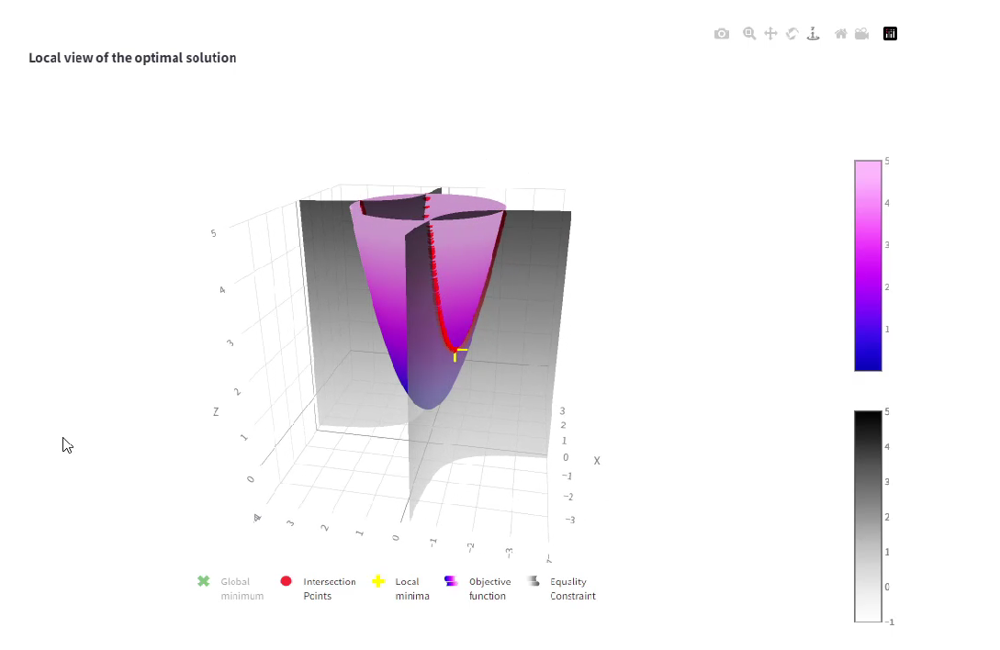

# Visual Optimization Solver

This project provides a web application for solving optimization problems and generating insightful reports. It uses the Python programming language and the Streamlit library for building the user interface. The application allows users to input optimization problems, solve them using various algorithms, and generate visualizations and reports.

## Features

- Solve optimization problems using Projected Gradient Descent (PGD) algorithm
- Visualize the solution process and the final solution
- Generate insightful reports on the optimization problem

## Installation

1. Create a conda environment:
``` console
conda create --name VisOptSolv python=3.10.14
```

or a virtual environement:

```console
python3.10 -m venv VisOptSolv
```

Then activate the created environment.

2. To install the required dependencies, run the following command:\
``` console
pip install -r requirements.txt
```


## Usage

To run the application, execute the following command:
``` console
streamlit run main.py
```


Then, open the application in your web browser at the URL displayed in the terminal.

## Contributing

Contributions and feedbacks are welcome! If you find any issues or have suggestions for improvements, please open an issue or submit a pull request.
